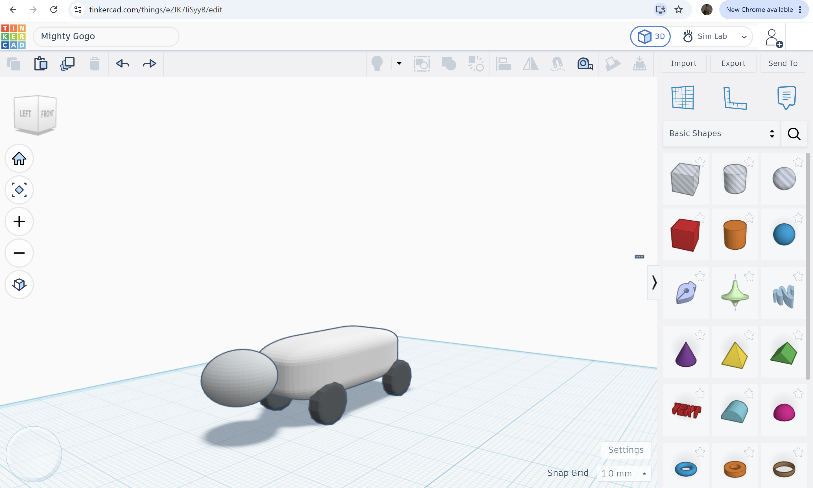
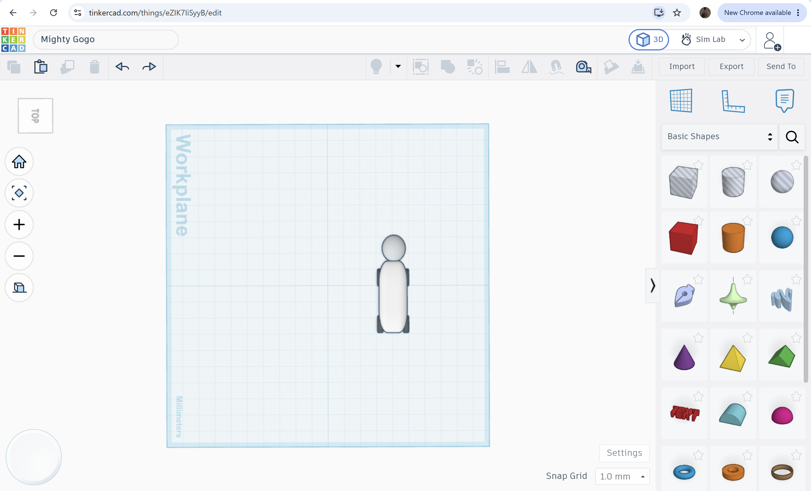
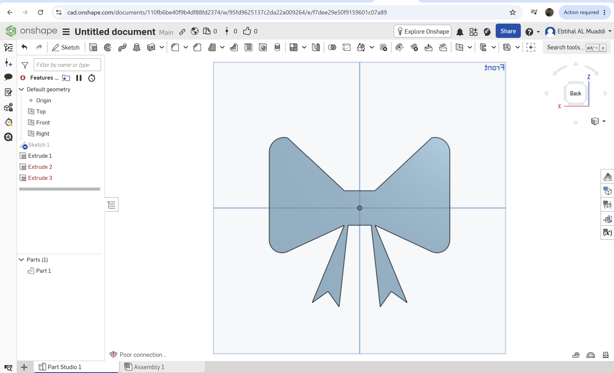
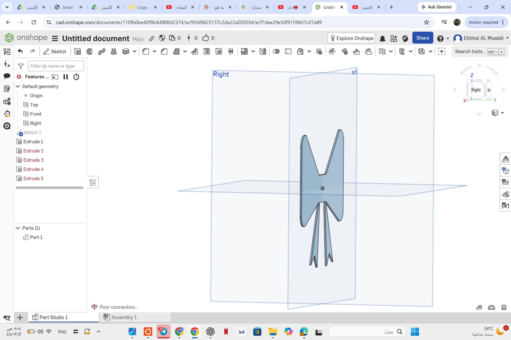

# Mechanical Design
## This folder contains all documentation related to the Mechanical Design track during my summer training.

# Task 01 – Initial Structural Design

## Tinkercad Design

**View the 3D Design:**
https://www.tinkercad.com/things/eZIK7IiSyyB/edit
## Design Preview

## Design Specifications

### 1. Number of Joints
- No joints are included in the initial design.

### 2. Degrees of Freedom (DOF)
- Forward and backward motion.
- Left and right turning.

### 3. Motors
- Four DC motors will be used.
- Each wheel is driven by an individual DC motor.

### 4. Stability and Center of Gravity
- The center of gravity is positioned at the middle of the robot, between the four wheels.
- The weight should be distributed evenly on both sides to improve stability.

### 5. Proposed Motion
- Forward movement.
- Backward movement.
- Left turn.
- Right turn.

### 6. Mechanical Challenges
- Wheel slippage on smooth surfaces.
- Chassis vibration during movement.

### 7. Torque Calculation

**Given:**
- Acceleration (a) = 9 m/s²
- Mass (m) = 1 kg
- Wheel radius (r) = 0.03 m

**Calculation:**

Force:
F = m × a = 1 × 9 = 9 N

Torque:
τ = F × r = 9 × 0.03 = **0.27 N·m**

**Result:**
- Required Torque = **0.27 N·m**

# Task 2: Logo Design

For the second task in the Mechanical Track, I created a logo using **Onshape**.

I started by opening a new project and making a simple sketch of the logo. After that, I used the different tools in Onshape to create the shape, adjust the dimensions, and add the details I needed. I also made some changes to the design until I was happy with the final result.

This task gave me a chance to practice using Onshape and understand how to create a design step by step, starting from a simple sketch and developing it into a finished model.

## 🛠️ Tool Used

* Onshape

 This is the link to my work: [Logo Design on Onshape](https://cad.onshape.com/documents/110fb6be40f9b4df88fd2374/w/95fd9625137c2da22a009264/e/f7dee29e50f9159601c07a89

 ## What I Learned📌:
How to create and edit sketches in Onshape.
How to use basic modeling and design tools.
How to adjust dimensions and shapes accurately.
How to develop a simple idea into a complete digital model.
Improved my understanding of basic mechanical design.

## Result

I successfully completed the logo design and gained more experience with Onshape and basic mechanical design.
