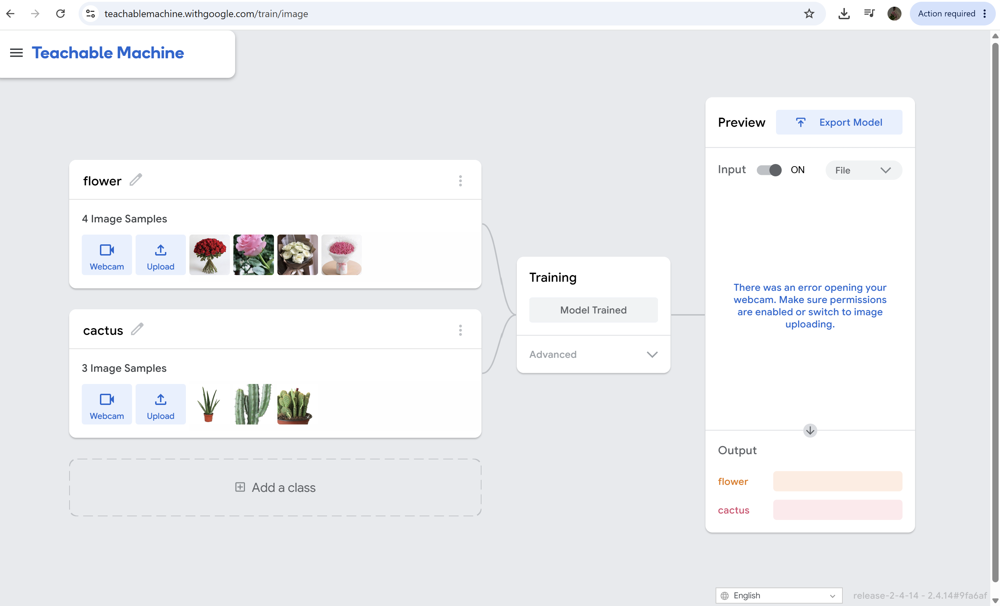
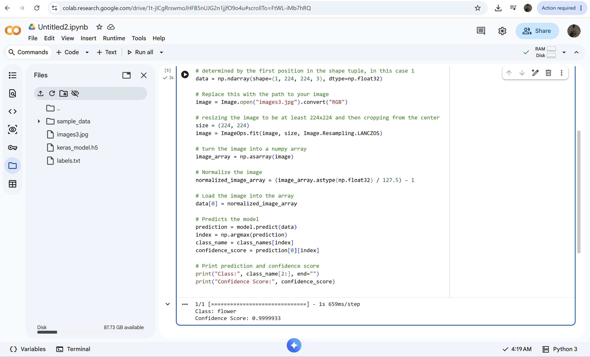

# Artificial Intelligence and Robotics

This folder documents all tasks, activities, and learning outcomes related to the Artificial Intelligence and Robotics track during my summer training.

## Task 1-Image Classification using Teachable Machine
## Description

In this task, I created an image classification model using **Teachable Machine** with two classes:

- 🌵 Cactus
- 🌹 Flower
  
After training the model, I tested its predictions using sample images to evaluate its accuracy. The trained model was then exported and integrated into **Google Colab**, where the generated Python code was executed successfully for image classification.

## Workflow

1. Created two image classes:
   - Cactus
   - Flower
2. Collected training images.
3. Trained the model using Teachable Machine.
- 
4. Tested the model's predictions.
5. Exported the trained model.
6. Imported the model into Google Colab.
7. Executed the generated Python code.
8. Verified the classification results
- 
- 

## Resu
lts
- Successfully trained a two-class image classification model.
- Successfully executed the exported model in Google Colab.
- Verified that the model correctly classified the test images.
  
## Status
✅ Completed
