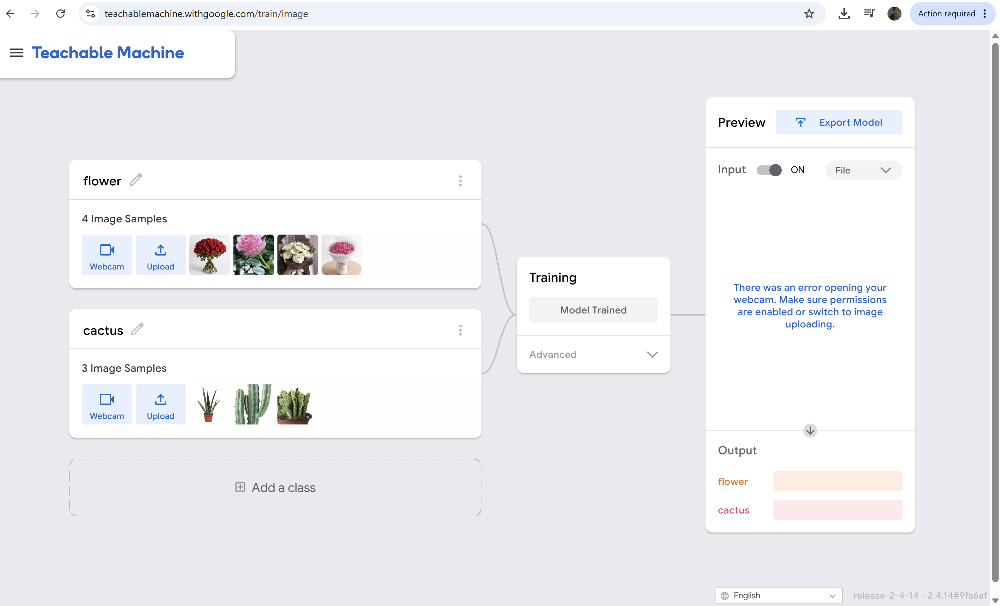
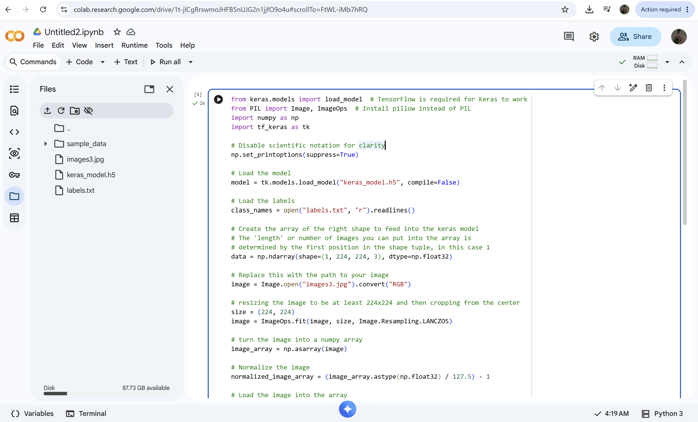
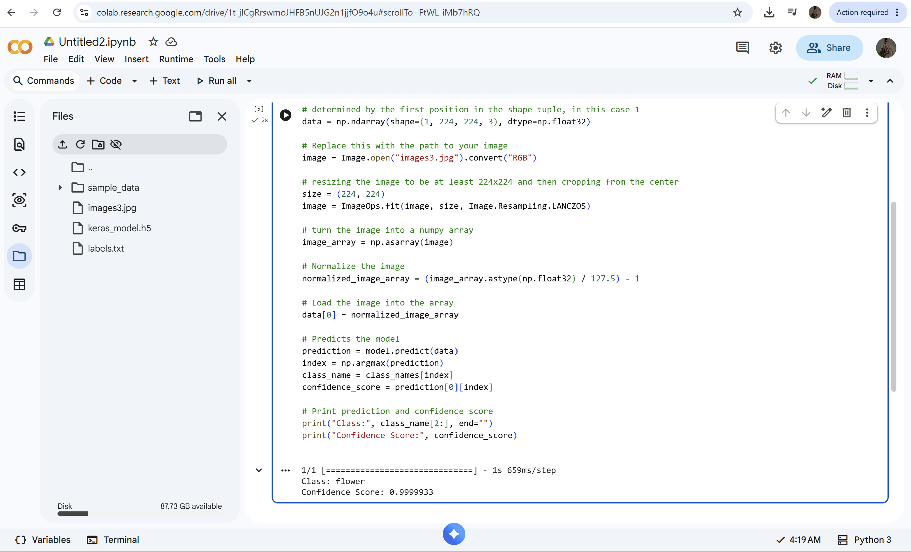
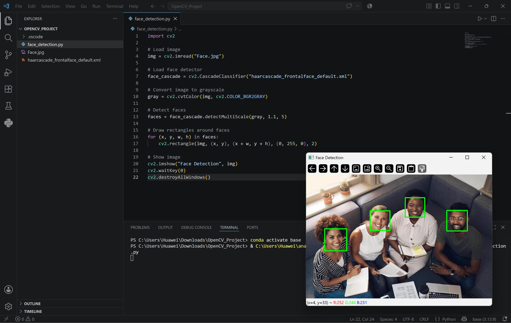
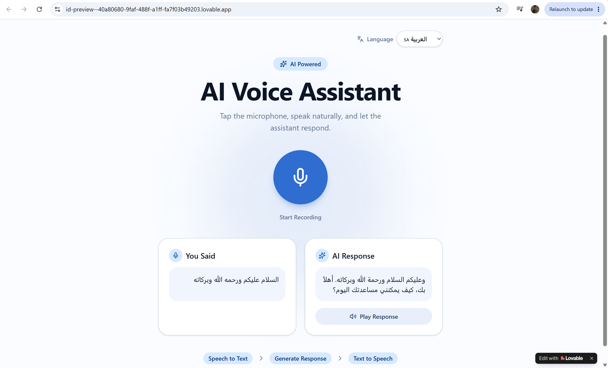
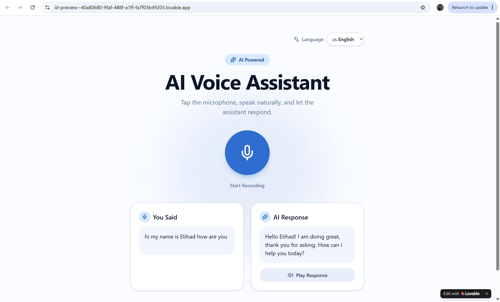

# Artificial Intelligence and Robotics

This folder documents all tasks, activities, and learning outcomes related to the Artificial Intelligence and Robotics track during my summer training.

# Task 01-Image Classification using Teachable Machine
## Description

In this task, I created an image classification model using **Teachable Machine** with two classes:

- 🌵 Cactus
- 🌹 Flower
  
After training the model, I tested its predictions using sample images to evaluate its accuracy. The trained model was then exported and integrated into **Google Colab**, where the generated Python code was executed successfully for image classification.

## Workflow

1. Created two image classes:
   - Cactus
   - Flower
2. Collected training images.
3. Trained the model using Teachable Machine.
- 
4. Tested the model's predictions.
5. Exported the trained model.
6. Imported the model into Google Colab.
7. Executed the generated Python code.
8. Verified the classification results
- 
- 

## Results
- Successfully trained a two-class image classification model.
- Successfully executed the exported model in Google Colab.
- Verified that the model correctly classified the test images.
  
## Status
✅ Completed
## 📂 Task 01 Files

The following files are associated with **Task 01 – Image Classification using Teachable Machine**:

-  `Untitled2.ipynb` — Google Colab notebook containing the Python implementation.
-  `Teachablemachine.png` — Teachable Machine project overview.
-  `Task1.png` — Google Colab code (Part 1).
-  `Task11.png` — Google Colab code (Part 2).
-  `keras_model.h5` — Exported trained AI model.
-  `labels.txt` — Class labels used by the trained model.

 # Task 02 -👁️ Face Detection with OpenCV

Welcome to my second AI task! 🤖

In this project, I built a simple face detection program using **OpenCV**. The program detects human faces in an image and highlights each face with a green rectangle.

## 🚀 Tools
- Python 🐍
- OpenCV 👁️
- Visual Studio Code 💻

## 📁 Project Files
- `face_detection.py` 
- `Face.jpg`
- `haarcascade_frontalface_default.xml` 
- `Task2.png` 
- `Task2 VS CODE.mp4` – video.

## 📸 Preview

## 💡 What I Learned
- Working with OpenCV.
- Detecting human faces in images.
- Processing images using Python.
- Building a simple Computer Vision application.!

# Task 03- AI Voice Assistant Website🤖

## Project Description

For this task, I created a simple AI Voice Assistant website with a clean and modern design. The website allows users to interact using their voice by converting speech into text, generating a response, and then reading the response aloud. It also supports both Arabic 🇸🇦 and English 🇺🇸, making the experience more flexible and user-friendly.

## Project Workflow🚀 
1- Select the preferred language (Arabic or English).
2- Click Start Recording and speak.
3- The speech is converted into text.
4- The assistant generates a suitable response.
5- The response appears on the screen.
6- The response is played back using Text-to-Speech.

 ## Tools Used
- Lovable AI
- Speech Recognition
- Text-to-Speech

## Result
The final website successfully demonstrates the complete workflow of an AI Voice Assistant in a simple and interactive way. It provides a smooth user experience with bilingual support, making voice interaction easy and enjoyable.
