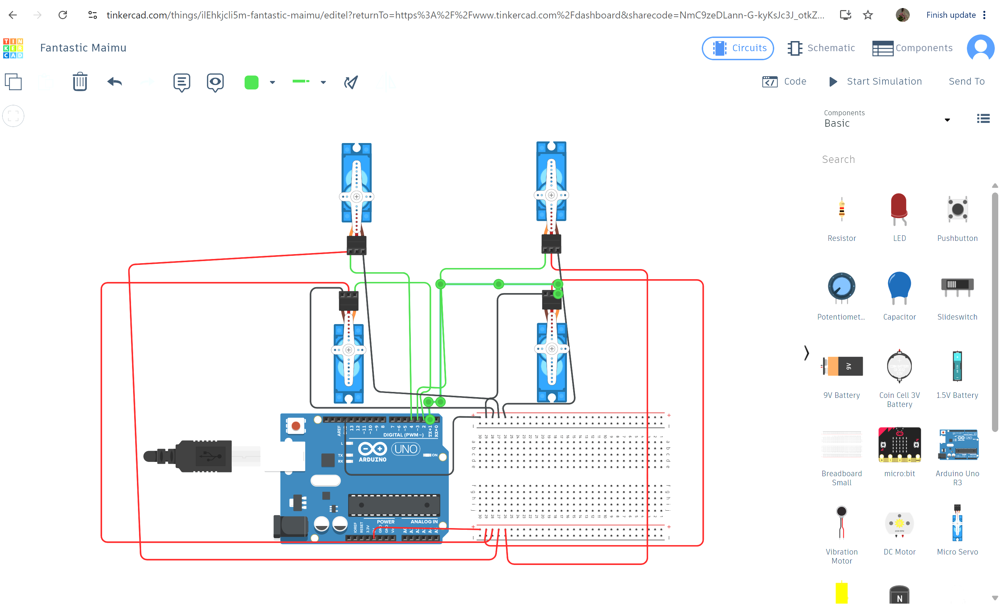

# Task 1
# 🤖 Four Servo Motors Control Using Arduino

## 📌 Project Description

In this project, I designed and tested an Arduino circuit in **Tinkercad** to control **four servo motors** at the same time.

The main idea was to program the motors to move together through a specific range. First, the servos rotate from **0° to 180°**, then return to their starting position at **0°**. At the end of the program, all four motors move to **90°**, where they stay as their final position.

This project helped me understand how servo motors can be connected to an Arduino and controlled using programmed angles.

---

## 🔧 Components Used

* Arduino Uno
* Breadboard
* 4 Servo Motors
* Jumper Wires
* Tinkercad Circuits

---

##  Circuit Design🖥️

The circuit was assembled and simulated using **Tinkercad**. The four servo motors were connected to the Arduino through the breadboard, with the required power, ground, and control connections.

**Circuit Preview**

-
## 🧪 Testing Process

### 1. Arduino Setup Test

I started by checking the Arduino setup and running a simple test to make sure the board was functioning correctly before adding all the motors.

https://github.com/user-attachments/assets/f391db2b-7a19-4c25-b44f-f30e0ab65dfb

### 2. Initial Servo Test

After confirming that the Arduino was working, I tested the servo connection and programmed the motor to rotate between **0° and 180°**, then return to **0°**.

https://github.com/user-attachments/assets/58ced596-a4d1-4703-a65a-fc418fe86851

### 3. Multiple Servo Control

Next, I connected the four servo motors and tested them together. All four motors responded to the same commands and moved simultaneously from **0° → 180° → 0°**.

https://github.com/user-attachments/assets/4db83406-0237-46f9-a64e-c3af44ce913f

### 4. Completed Version

For the final version, I modified the program so that after completing the movement sequence, all four servos move to **90°** and stay there.

🎥 [View Final Demonstration](https://youtu.be/lsQdQvgrjPw)

---

## ⚙️ How the System Works

The Arduino sends control signals to each servo motor. The program determines the angle of rotation and makes the four motors perform the same movement at the same time.

The movement sequence is:

**0° → 180° → 0° → 90°**

The final position is **90°**, where all four servo motors remain stationary.

---

## ✨ Main Features

* Simultaneous control of four servo motors.
* Programmable servo angles.
* Movement between **0° and 180°**.
* Final positioning at **90°**.
* Arduino-based control system.
* Complete circuit simulation using Tinkercad.

---

## 💻 Tools & Technologies

* **Arduino Uno**
* **C++ / Arduino IDE code**
* **Tinkercad Circuits**

---

## 🔗 Tinkercad Project

The complete circuit and simulation can be viewed through the following link:

🔗 [Open Tinkercad Project](https://www.tinkercad.com/things/ilEhkjcli5m-fantastic-maimu/editel?returnTo=https%3A%2F%2Fwww.tinkercad.com%2Fdashboard&sharecode=NmC9zeDLann-G-kyKsJc3J_otkZwdw5-s96dP9OhPmU)

---

## 👩🏻‍💻 Author

**Ebtihal**

