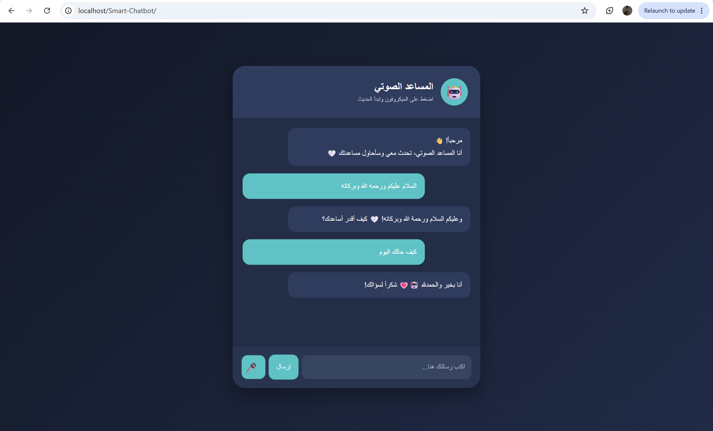

# 🌐 Web and Application Programming Track

Projects and tasks completed during the Web and Application Programming Track.

##  Tasks 📌 
## Task 1 Smart Chatbot🤖
- A simple bilingual chatbot developed using HTML, CSS, JavaScript, and PHP.

### Technologies
- HTML
- CSS
- JavaScript
- PHP
- XAMPP

  - 
  
###  Features✨
-  Chat interface
- 🇸🇦 Arabic & English support
-  Voice input
-  Automated responses

###   How I Built the Project🚀

1. **Create the project files**
   - Created four files for the chatbot:
     `index.html`, `style.css`, `script.js`, and `chatbot.php`.

2. **Build the interface**
   - Used HTML to create the chatbot structure, including the header, chat area, message box, and buttons.

3. **Design the chatbot**
   - Used CSS to design the interface, colors, buttons, messages, and overall layout.

4. **Add interaction**
   - Used JavaScript to send user messages, display chatbot responses, and add voice input functionality.

5. **Create the PHP backend**
   - Used PHP to receive the user's message and generate an appropriate response.
   - Added simple responses for Arabic and English messages.

6. **Install and configure XAMPP**
   - Installed XAMPP and started the Apache server to run the PHP project locally.

7. **Move the project to htdocs**
   - Placed the `Smart-Chatbot` project folder inside the XAMPP `htdocs` folder.

8. **Run the chatbot**
   - Opened the project through the browser using:
     `http://localhost/Smart-Chatbot/`

9. **Test the chatbot**
   - Tested Arabic messages and checked that the chatbot responded correctly.
   - Tested the microphone button and the overall interface.

10. **Upload the project to GitHub**
   - Uploaded all project files to GitHub and created this README file to document the project and its development steps.

###  Final Result🎯

The chatbot was successfully built and tested locally. It provides a simple and interactive interface that allows users to send messages and receive automated responses. The final design is clean, functional, and easy to use.
